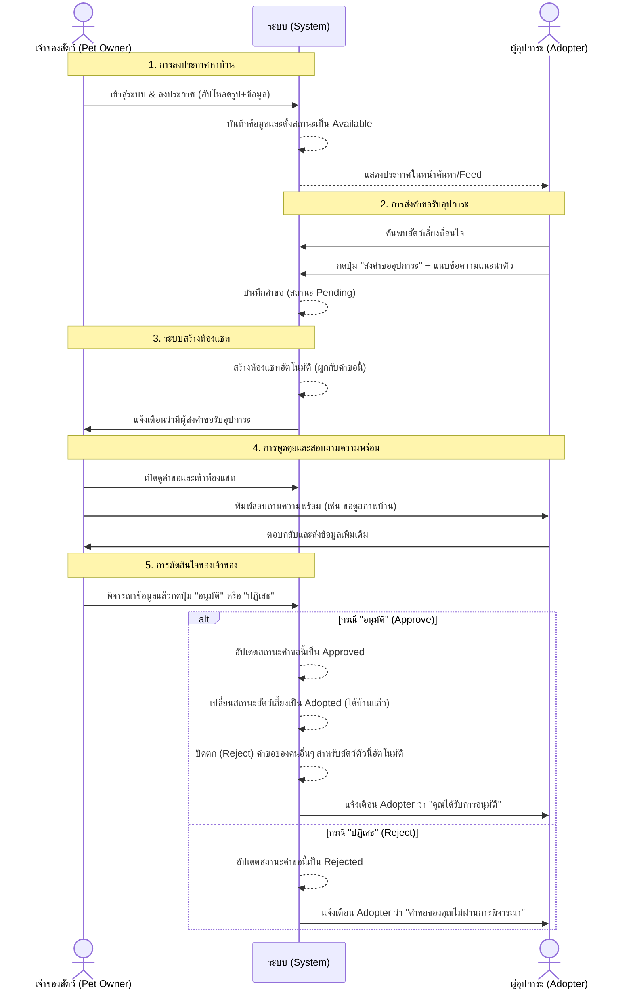

# 04 — กระบวนการทำงานแบบบูรณาการ (Integrated Adoption Workflow)

> **โปรเจกต์:** PET-HOME — แพลตฟอร์มสื่อกลางหาบ้านให้สัตว์เลี้ยง
> **เอกสาร:** Step 1.4 | Phase 1 — Planning Only
> **อ้างอิงจาก:** `01-system-overview.md`, `02-requirements.md`, `03-roles-permissions.md`

เอกสารนี้อธิบายลำดับกระบวนการทำงานตั้งแต่การลงประกาศ ไปจนถึงการจับคู่บ้านให้สัตว์เลี้ยงสำเร็จ (End-to-End Workflow) ตาม 6 ขั้นตอนหลักที่กำหนดไว้

---

## แผนผังลำดับขั้นตอนการทำงาน (Sequence Diagram)

---

## คำอธิบายรายละเอียดแต่ละขั้นตอน

### 1. การลงประกาศหาบ้าน
เจ้าของสัตว์เลี้ยงเข้าสู่ระบบและ **ลงประกาศ** โดยการกรอกรายละเอียดและอัปโหลดรูปภาพสัตว์เลี้ยง เมื่อกดยืนยัน ระบบจะตั้งสถานะประกาศเป็น `Available` (ว่าง) ทำให้บุคคลทั่วไปสามารถค้นหาและมองเห็นประกาศนี้ได้ในหน้ารวม (Feed)

### 2. การส่งคำขอรับอุปการะ
ผู้อุปการะที่สนใจและเข้าสู่ระบบแล้ว สามารถเข้ามากดปุ่ม **"ส่งคำขออุปการะ"** ที่หน้ารายละเอียดของสัตว์เลี้ยง ระบบจะบังคับให้ผู้อุปการะแนบข้อความแนะนำตัวสั้นๆ เพื่อแสดงความตั้งใจ จากนั้นระบบจะบันทึกคำขอนี้ไว้ในสถานะ `Pending` (รอพิจารณา)

### 3. การสร้างห้องแชทอัตโนมัติ
ทันทีที่การส่งคำขออุปการะเสร็จสมบูรณ์ ระบบจะทำการ **สร้างห้องแชท (Chat Room)** ขึ้นมาโดยอัตโนมัติ 1 ห้อง เพื่อใช้สำหรับคำขอนี้โดยเฉพาะ พร้อมส่งการแจ้งเตือน (Notification) ไปยังเจ้าของสัตว์เลี้ยง

### 4. การพูดคุยสอบถามความพร้อม
เจ้าของสัตว์เลี้ยงและผู้อุปการะสามารถเข้าไปที่ห้องแชทที่ระบบสร้างให้ เพื่อพิมพ์ **พูดคุยสอบถามความพร้อม** ระหว่างกัน เช่น เจ้าของอาจขอให้ผู้อุปการะถ่ายรูปสภาพแวดล้อมบริเวณบ้านที่จะนำสัตว์ไปเลี้ยง หรือสอบถามประสบการณ์การเลี้ยงสัตว์ที่ผ่านมา

### 5. การตัดสินใจของเจ้าของสัตว์
เมื่อพูดคุยจนได้ข้อมูลครบถ้วนแล้ว เจ้าของสัตว์เลี้ยงจะกลับมาที่ระบบเพื่อพิจารณาและทำการตัดสินใจ โดยมีปุ่มให้เลือกระหว่าง **"อนุมัติ" (Approve)** หรือ **"ปฏิเสธ" (Reject)** ผู้อุปการะรายนั้นๆ

### 6. การจัดการสถานะหลังการตัดสินใจ
- **หากเจ้าของกด "อนุมัติ":** 
  - สัตว์เลี้ยงตัวนั้นจะถือว่าได้บ้านเป็นที่เรียบร้อย สถานะของประกาศจะถูกเปลี่ยนเป็น `Adopted` โดยอัตโนมัติ
  - ส่วนคำขอรับอุปการะจากผู้อื่นที่ยังค้างอยู่ในระบบ (คิวอื่นๆ ที่สถานะเป็น Pending) ระบบจะทำการ **ปัดตก (ปฏิเสธ)** ให้อัตโนมัติทั้งหมด เพื่อไม่ให้เกิดความหวังค้างคา
- **หากเจ้าของกด "ปฏิเสธ":** 
  - คำขอนั้นจะถูกยกเลิกไป ผู้อุปการะจะได้รับแจ้งเตือน และประกาศสัตว์เลี้ยงจะยังคงเปิดรับคำขอจากบุคคลอื่นต่อไป
